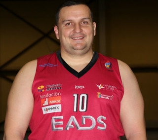
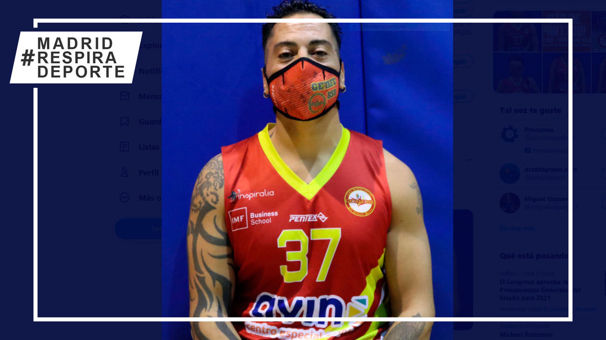
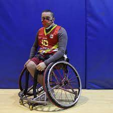
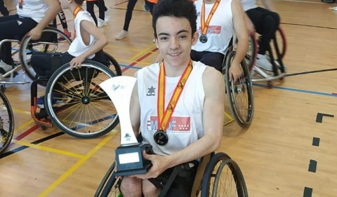
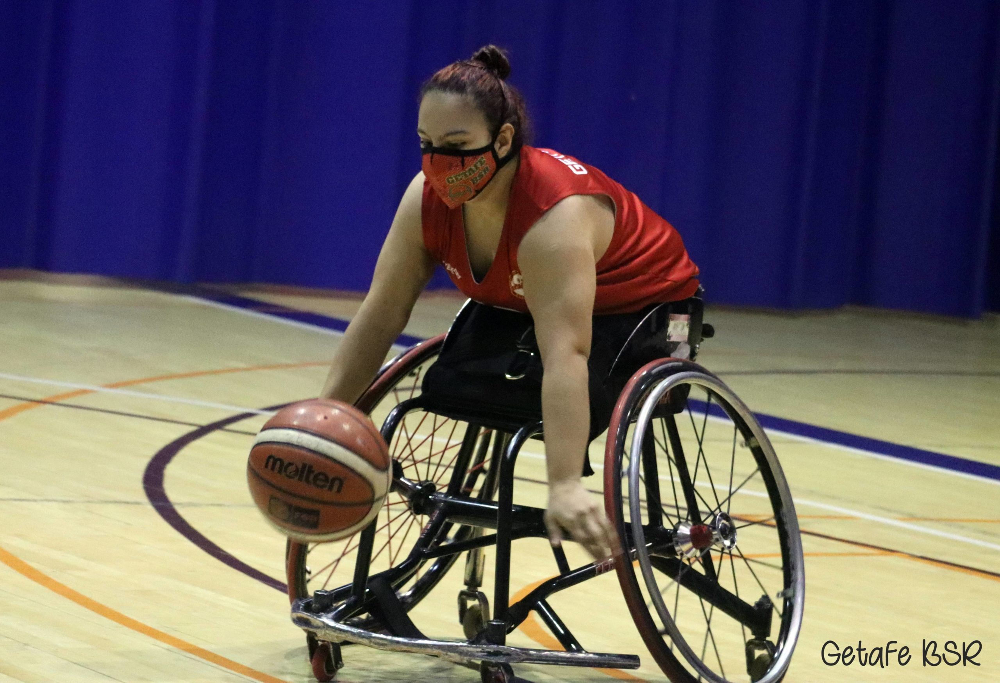
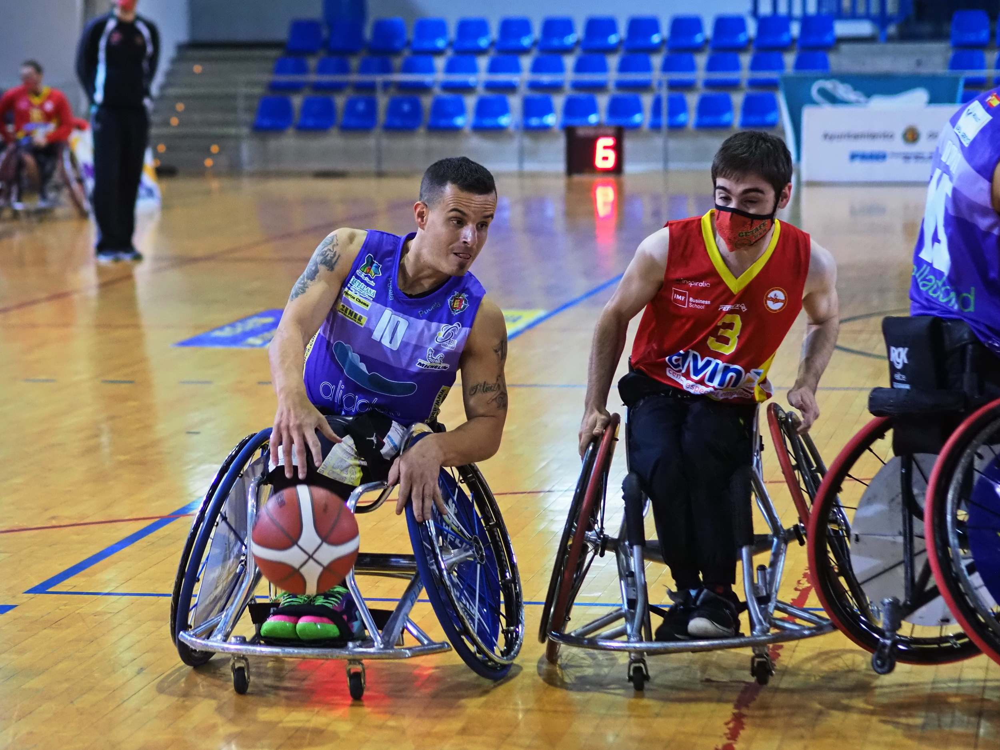
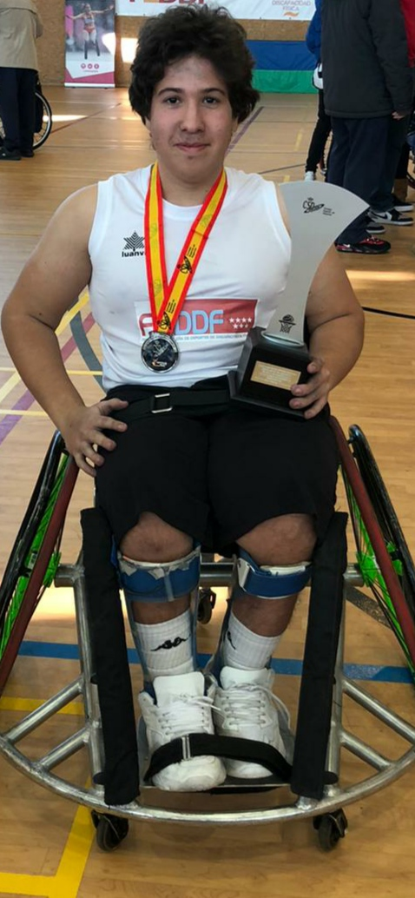
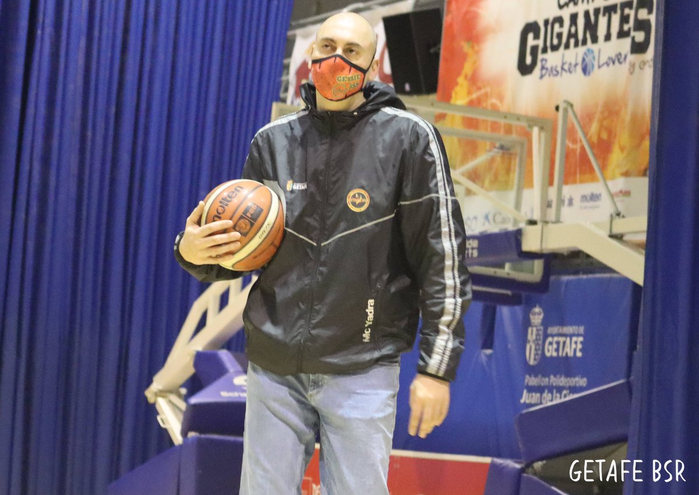
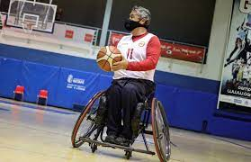
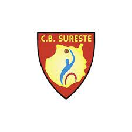

<!DOCTYPE html>
<html lang="en">
<head>
    <meta charset="UTF-8">
    <meta http-equiv="X-UA-Compatible" content="IE=edge">
    <meta name="viewport" content="width=device-width, initial-scale=1.0">
    <link rel="stylesheet" type="text/css" href="pagina web.css">
    <title>Document</title>
</head>
<body>
    
  
   <h1>Getafe bsr</h1> 
    

   

    <a href="pagina web.html">Inicio</a>
    <a href="pagina web1.html">Jugadores</a>
    <a href="pagina web2.html">Clasificación</a>
    

    <button class="dropbtn" onclick="myFunction()">partidos
      <i class="fa fa-caret-down"></i>
    </button>
    

      <a href="pagina web3.html">Getafe vs Sevilla</a>
      <a href="pagina web4.html">Getafe vs Leganés</a>
      <a href="pagina web5.html">Getafe vs Granada</a>
      <a href="pagina web6.html">Getafe vs Canarias</a>
    

    
 
  

  

    El CID Casa Murcia Getafe, se crea en el año 1991. En el año 2003 cuando la Casa de la Región de Murcia en Getafe, entidad sin ánimo de lucro, integra en su estructura al entonces CID Getafe, evitando su desaparición. En la actualidad ha pasado a ser un gran referente, a nivel nacional e internacional, en el deporte de Baloncesto en silla de ruedas, siendo un referente social por sus actuaciones y desarrollo de actividades.
 
 
    El esfuerzo personal y colectivo, el trabajo en equipo, la capacidad de superación ante las dificultades y el respeto hacia las personas, nos permiten establecer una actividad deportiva y social de forma responsable y ética. Como muestra del compromiso adoptado, nuestra Entidad se encuentra adherida al Chárter de la Diversidad España.
 
 
    Consideramos el derecho de no discriminación, por ninguna condición social o personal, como uno de los principios básicos que rigen nuestra razón de ser.

 
 
 
 
 
 

   
</body>
</html>

body {
  background-color: #00f7ff; 
  justify-content: center;
  align-items: center;
  margin: 0;
  height: 100%;
  text-align: center;
  font-family: Verdana, sans-serif; 
}

.navbar {
  overflow: hidden;
  background-color: #333;
  font-family: Arial, Helvetica, sans-serif;
}

.navbar a {
  float: left;
  font-size: 16px;
  color: white;
  text-align: center;
  padding: 14px 16px;
  text-decoration: none;
}

.dropdown {
  float: left;
  overflow: hidden;
}

.dropdown .dropbtn {
  cursor: pointer;
  font-size: 16px;  
  border: none;
  outline: none;
  color: white;
  padding: 14px 16px;
  background-color: inherit;
  font-family: inherit;
  margin: 0;
}

.navbar a:hover, .dropdown:hover .dropbtn, .dropbtn:focus {
  background-color: red;
}

.dropdown-content {
  display: none;
  position: absolute;
  background-color: #f9f9f9;
  min-width: 160px;
  box-shadow: 0px 8px 16px 0px rgba(0,0,0,0.2);
  z-index: 1;
}

.dropdown-content a {
  float: none;
  color: black;
  padding: 12px 16px;
  text-decoration: none;
  display: block;
  text-align: left;
}

.dropdown-content a:hover {
  background-color: #ddd;
}

.show {
  display: block;
}

body, html {
    height: 100%;
  }
  
  .parallax {
    background-image: url('getafe.png');
  
    height: 100%; 
  
    background-attachment: fixed;
    background-position: center;
    background-repeat: no-repeat;
    background-size: cover;
  }

.iconos-sociales img{ 
  transition:all 0.5s ease-out; 
  }
  .iconos-sociales img:hover{ 
  box-shadow: 0px 1px 1px 1px rgba(0, 0, 0, 0.1); 
  transform:translate(0px, -5px); 
  }
  
  .iconos-sociales img{ 
    transition:all 0.5s ease-out; border-radius:50px;
    }
    .iconos-sociales img:hover{
    box-shadow: 0px 1px 1px 1px rgba(0, 0, 0, 0.1);
    transform:translate(0px, -10px); 
    }
    
    
    
    
    
    <!DOCTYPE html>
<html lang="en">
<head>
    <meta charset="UTF-8">
    <meta http-equiv="X-UA-Compatible" content="IE=edge">
    <meta name="viewport" content="width=device-width, initial-scale=1.0">
    <link rel="stylesheet" type="text/css" href="pagina web1.css">
    <title>Document</title>
</head>
<body>
    <h1>Jugadores</h1>
     
    

        <a href="pagina web.html">Inicio</a>
        <a href="pagina web1.html">Jugadores</a>
        <a href="pagina web2.html">Clasificación</a>
        

            <button class="dropbtn" onclick="myFunction()">partidos
            <i class="fa fa-caret-down"></i>
            </button>
            

            <a href="pagina web3.html">Getafe vs Sevilla</a>
            <a href="pagina web4.html">Getafe vs Leganés</a>
            <a href="pagina web5.html">Getafe vs Granada</a>
            <a href="pagina web6.html">Getafe vs Canarias</a>
            

        
 
    
 
    
      
         
         
         
    

        
 
            <figure class="snip0015">
                
                <figcaption>
                    <h2>Carlos</h2>
                    
Su posición es pívot

                    
                </figcaption>			
            </figure>
        

        

            <figure class="snip0015">
                
                <figcaption>
                    <h2>Lucia</h2>
                    
Su posición es base

                    
                </figcaption>			
            </figure>
        
 
        

            <figure class="snip0015">
                
                <figcaption>
                    <h2>Juan</h2>
                    
Su posición es ala-pívot

                    
                </figcaption>			
            </figure>
        

    

     
     
     
     
     
     
     
     
     
     
     
     
     
     
     

    

        
 
            <figure class="snip0015">
                
                <figcaption>
                    <h2>Jordan</h2>
                    
Su posición es ala-pívot

                    
                </figcaption>			
            </figure>
        

        

            <figure class="snip0015">
                
                <figcaption>
                    <h2>Yeray</h2>
                    
Su posición es escolta

                    
                </figcaption>			
            </figure>
        
 
        

            <figure class="snip0015">
                
                <figcaption>
                    <h2>Samuel</h2>
                    
Su posición es alero

                    
                </figcaption>			
            </figure>
        

    

 
 
 
 
 
 
 
 
 
 
 
 
 
 
 

    
 
        <figure class="snip0015">
            
            <figcaption>
                <h2>Sindy</h2>
                
Su posición es alero

                
            </figcaption>			
        </figure>
    

    

        <figure class="snip0015">
            
            <figcaption>
                <h2>Álvaro</h2>
                
Su posición es escolta

                
            </figcaption>			
        </figure>
    
 
    

        <figure class="snip0015">
            
            <figcaption>
                <h2>Ismael</h2>
                
Su posición es escolta

                
            </figcaption>			
        </figure>
    

 
 
 
 
 
 
 
 
 
 
 
 
 
 
 

    
 
        <figure class="snip0015">
            
            <figcaption>
                <h2>Poly</h2>
                
Es el 1º Entrenador

                
            </figcaption>			
        </figure>
    

    

        <figure class="snip0015">
            
            <figcaption>
                <h2>Manolo</h2>
                
Es el 2º Entrenador

                
            </figcaption>			
        </figure>
    
 
    

        <figure class="snip0015">
            
            <figcaption>
                <h2>Pedro</h2>
                
Es el 3º Entrenador

                
            </figcaption>			
        </figure>
    

 
 
 
 
 
 
 
 
 
 
 
 
 
 
 
 

</body>
</html>

body {
  background-color: #9eff02; 
  justify-content: center;
  align-items: center;
  margin: 0;
  height: 100%;
  text-align: center;
  font-family: Verdana, sans-serif; 
}

.navbar {
  overflow: hidden;
  background-color: #333;
  font-family: Arial, Helvetica, sans-serif;
}

.navbar a {
  float: left;
  font-size: 16px;
  color: white;
  text-align: center;
  padding: 14px 16px;
  text-decoration: none;
}

.dropdown {
  float: left;
  overflow: hidden;
}

.dropdown .dropbtn {
  cursor: pointer;
  font-size: 16px;  
  border: none;
  outline: none;
  color: white;
  padding: 14px 16px;
  background-color: inherit;
  font-family: inherit;
  margin: 0;
}

.navbar a:hover, .dropdown:hover .dropbtn, .dropbtn:focus {
  background-color: red;
}

.dropdown-content {
  display: none;
  position: absolute;
  background-color: #f9f9f9;
  min-width: 160px;
  box-shadow: 0px 8px 16px 0px rgba(0,0,0,0.2);
  z-index: 1;
}

.dropdown-content a {
  float: none;
  color: black;
  padding: 12px 16px;
  text-decoration: none;
  display: block;
  text-align: left;
}

.dropdown-content a:hover {
  background-color: #ddd;
}

.show {
  display: block;
}

figure.snip0015 {
  font-family: 'Raleway', Arial, sans-serif;
  color: #fff;
  position: relative;
  overflow: hidden;
  margin: 10px;
  min-width: 220px;
  max-width: 310px;
  max-height: 220px;
  width: 100%;
  background: #ffffff;
  text-align: center;
}
figure.snip0015 * {
  -webkit-box-sizing: border-box;
  box-sizing: border-box;
}
figure.snip0015 img {
  opacity: 1;
  width: 100%;
  -webkit-transition: opacity 0.35s;
  transition: opacity 0.35s;
}
figure.snip0015 figcaption {
  position: absolute;
  bottom: 0;
  left: 0;
  padding: 3em 3em;
  width: 100%;
  height: 100%;
}
figure.snip0015 figcaption::before {
  position: absolute;
  top: 50%;
  right: 30px;
  bottom: 50%;
  left: 30px;
  border-top: 1px solid rgba(255, 255, 255, 0.8);
  border-bottom: 1px solid rgba(255, 255, 255, 0.8);
  content: '';
  opacity: 0;
  background-color: #ffffff;
  -webkit-transition: all 0.4s;
  transition: all 0.4s;
  -webkit-transition-delay: 0.6s;
  transition-delay: 0.6s;
}
figure.snip0015 h2,
figure.snip0015 p {
  margin: 0 0 5px;
  opacity: 0;
  -webkit-transition: opacity 0.35s, -webkit-transform 0.35s;
  transition: opacity 0.35s,-webkit-transform 0.35s,-moz-transform 0.35s,-o-transform 0.35s,transform 0.35s;
}
figure.snip0015 h2 {
  word-spacing: -0.15em;
  font-weight: 300;
  text-transform: uppercase;
  -webkit-transform: translate3d(0%, 50%, 0);
  transform: translate3d(0%, 50%, 0);
  -webkit-transition-delay: 0.3s;
  transition-delay: 0.3s;
}
figure.snip0015 h2 span {
  font-weight: 800;
}
figure.snip0015 p {
  font-weight: 200	;
  -webkit-transition-delay: 0s;
  transition-delay: 0s;
}
figure.snip0015 a {
  left: 0;
  right: 0;
  top: 0;
  bottom: 0;
  position: absolute;
  color: #ffffff;
}
figure.snip0015:hover img {
  opacity: 0.35;
}
figure.snip0015:hover figcaption h2 {
  opacity: 1;
  -webkit-transform: translate3d(0%, 0%, 0);
  transform: translate3d(0%, 0%, 0);
  -webkit-transition-delay: 0.3s;
  transition-delay: 0.3s;
}
figure.snip0015:hover figcaption p {
  opacity: 0.9;
  -webkit-transition-delay: 0.6s;
  transition-delay: 0.6s;
}
figure.snip0015:hover figcaption::before {
  background: rgb(0, 0, 0);
  top: 30px;
  bottom: 30px;
  opacity: 1;
  -webkit-transition-delay: 0s;
  transition-delay: 0s;
} 

.container {
  display: grid;
  grid-template-columns: auto auto auto;
}

.div1 {
  position: absolute;
  width: 25%;
}

.div2 {
  position: absolute;
  right: 550px;
  width: 25%;
}

.div3 {
  position: absolute;
  right: 75px;
  width: 25%;
}

.div4 {
  position: absolute;
  width: 25%;
}

.div5 {
  position: absolute;
  right: 550px;
  width: 25%;
}

.div6 {
  position: absolute;
  right: 75px;
  width: 25%;
}

.div7 {
  position: absolute;
  width: 25%;
}

.div8 {
  position: absolute;
  right: 550px;
  width: 25%;
}

.div9 {
  position: absolute;
  right: 75px;
  width: 25%;
}

.div10 {
  position: absolute;
  width: 25%;
}

.div11 {
  position: absolute;
  right: 550px;
  width: 25%;
}

.div12 {
  position: absolute;
  right: 75px;
  width: 25%;
}

.iconos-sociales img{ 
  transition:all 0.5s ease-out; 
  }
  .iconos-sociales img:hover{ 
  box-shadow: 0px 1px 1px 1px rgba(0, 0, 0, 0.1); 
  transform:translate(0px, -5px); 
  }
  
  .iconos-sociales img{ 
    transition:all 0.5s ease-out; border-radius:50px;
    }
    .iconos-sociales img:hover{
    box-shadow: 0px 1px 1px 1px rgba(0, 0, 0, 0.1);
    transform:translate(0px, -10px); 
    }

<!DOCTYPE html>
<html lang="en">
<head>
    <meta charset="UTF-8">
    <meta http-equiv="X-UA-Compatible" content="IE=edge">
    <meta name="viewport" content="width=device-width, initial-scale=1.0">
    <link rel="stylesheet" type="text/css" href="pagina web2.css">
    <title>Document</title>
</head>
<body>
  <h1>Clasificación</h1>
     
    

      <a href="pagina web.html">Inicio</a>
      <a href="pagina web1.html">Jugadores</a>
      <a href="pagina web2.html">Clasificación</a>
      

      <button class="dropbtn" onclick="myFunction()">partidos
        <i class="fa fa-caret-down"></i>
      </button>
      

        <a href="pagina web3.html">Getafe vs Sevilla</a>
        <a href="pagina web4.html">Getafe vs Leganés</a>
        <a href="pagina web5.html">Getafe vs Granada</a>
        <a href="pagina web6.html">Getafe vs Canarias</a>
      

      
 
    

  
    

 
 
 
 
 
 
 
 
 
 
 
 
 
 
 
 
 
 
 

  

    
1 / 5

    
    
1º Puesto

  

  
  

    
2 / 5

    
    
2º puesto

  

  
  

    
3 / 5

    
    
3º Puesto

  

  

    
4 / 5

    
    
4º Puesto

  

  

    
5 / 5

    
    
5º Puesto

  

  
  <a class="prev" onclick="plusSlides(-1)">&#10094;</a>
  <a class="next" onclick="plusSlides(1)">&#10095;</a>
  
  

   
  
  

     
     
     
    
    
  

 
 
 
 
 
 
 
 
 
 
 
 
 
 
 
 
 
 
 
 
 
 
 
 
 
 
 
 
 
 
 
 
 
 
 
 
 
 
 
 
 
 

  

    
1 / 5

    
    
1º Puesto

  

  
  

    
2 / 5

    
    
2º puesto

  

  
  

    
3 / 5

    
    
3º Puesto

  

  

    
4 / 5

    
    
4º Puesto

  

  

    
5 / 5

    
    
5º Puesto

  

  
  <a class="prev" onclick="plusSlides(-1)">&#10094;</a>
  <a class="next" onclick="plusSlides(1)">&#10095;</a>
  
  

   
  
  

     
     
     
    
    
  

 
 
 
 
 
 
 
 
 
 
 

</body>
</html>
  
  
  
  
  
  
  
  body {
  background-color: #eeff00; 
  justify-content: center;
  align-items: center;
  margin: 0;
  height: 100%;
  text-align: center;
  font-family: Verdana, sans-serif; 
}

.navbar {
  overflow: hidden;
  background-color: #333;
  font-family: Arial, Helvetica, sans-serif;
}

.navbar a {
  float: left;
  font-size: 16px;
  color: white;
  text-align: center;
  padding: 14px 16px;
  text-decoration: none;
}

.dropdown {
  float: left;
  overflow: hidden;
}

.dropdown .dropbtn {
  cursor: pointer;
  font-size: 16px;  
  border: none;
  outline: none;
  color: white;
  padding: 14px 16px;
  background-color: inherit;
  font-family: inherit;
  margin: 0;
}

.navbar a:hover, .dropdown:hover .dropbtn, .dropbtn:focus {
  background-color: red;
}

.dropdown-content {
  display: none;
  position: absolute;
  background-color: #f9f9f9;
  min-width: 160px;
  box-shadow: 0px 8px 16px 0px rgba(0,0,0,0.2);
  z-index: 1;
}

.dropdown-content a {
  float: none;
  color: black;
  padding: 12px 16px;
  text-decoration: none;
  display: block;
  text-align: left;
}

.dropdown-content a:hover {
  background-color: #ddd;
}

.show {
  display: block;
}

.iconos-sociales img{ 
  transition:all 0.5s ease-out; 
  }
  .iconos-sociales img:hover{ 
  box-shadow: 0px 1px 1px 1px rgba(0, 0, 0, 0.1); 
  transform:translate(0px, -5px); 
  }
  
  .iconos-sociales img{ 
    transition:all 0.5s ease-out; border-radius:50px;
    }
    .iconos-sociales img:hover{
    box-shadow: 0px 1px 1px 1px rgba(0, 0, 0, 0.1);
    transform:translate(0px, -10px); 
    }

    * {
      box-sizing: border-box
    }

.mySlides {
  display: none
}

img {
  vertical-align: middle;
}

.slideshow-container {
  max-width: 1000px;
  position: relative;
  margin: auto;
}

.prev, .next {
  cursor: pointer;
  position: absolute;
  top: 50%;
  width: auto;
  padding: 16px;
  margin-top: -22px;
  color: rgb(1, 255, 200);
  font-weight: bold;
  font-size: 18px;
  transition: 0.6s ease;
  border-radius: 0 3px 3px 0;
  user-select: none;
}

.next {
  right: 0;
  border-radius: 3px 0 0 3px;
}

.prev:hover, .next:hover {
  background-color: rgba(255, 0, 0, 0.8);
}

.text {
  color: #000000;
  font-size: 15px;
  padding: 8px 12px;
  position: absolute;
  bottom: 8px;
  width: 100%;
  text-align: center;
}

.numbertext {
  color: #000000;
  font-size: 12px;
  padding: 8px 12px;
  position: absolute;
  top: 0;
}

.dot {
  cursor: pointer;
  height: 15px;
  width: 15px;
  margin: 0 2px;
  background-color: rgb(0, 0, 0);
  border-radius: 50%;
  display: inline-block;
  transition: background-color 0.6s ease;
}

.active, .dot:hover {
  background-color: #000000;
}

.fade {
  -webkit-animation-name: fade;
  -webkit-animation-duration: 1.5s;
  animation-name: fade;
  animation-duration: 1.5s;
}

@-webkit-keyframes fade {
  from {opacity: .4} 
  to {opacity: 1}
}

@keyframes fade {
  from {opacity: .4} 
  to {opacity: 1}
}

@media only screen and (max-width: 300px) {
  .prev, .next,.text {font-size: 11px}
}

* {
  box-sizing: border-box
}

.mySlides {
display: none
}

img {
vertical-align: middle;
}

.slideshow-container {
max-width: 1000px;
position: relative;
margin: auto;
}

.prev, .next {
cursor: pointer;
position: absolute;
top: 50%;
width: auto;
padding: 16px;
margin-top: -22px;
color: rgb(1, 255, 200);
font-weight: bold;
font-size: 18px;
transition: 0.6s ease;
border-radius: 0 3px 3px 0;
user-select: none;
}

.prev {
    left: 0;
    border-radius: 3px 0 0 3px;
    }
    
.next {
right: 0;
border-radius: 3px 0 0 3px;
}

.prev:hover, .next:hover {
background-color: rgba(255, 0, 0, 0.8);
}

.text {
color: #000000;
font-size: 15px;
padding: 8px 12px;
position: absolute;
bottom: 8px;
width: 100%;
text-align: center;
}

.numbertext {
color: #000000;
font-size: 12px;
padding: 8px 12px;
position: absolute;
top: 0;
}

.dot {
cursor: pointer;
height: 15px;
width: 15px;
margin: 0 2px;
background-color: #bbb;
border-radius: 50%;
display: inline-block;
transition: background-color 0.6s ease;
}

.active, .dot:hover {
background-color: #717171;
}

.fade {
-webkit-animation-name: fade;
-webkit-animation-duration: 1.5s;
animation-name: fade;
animation-duration: 1.5s;
}

@-webkit-keyframes fade {
from {opacity: .4} 
to {opacity: 1}
}

@keyframes fade {
from {opacity: .4} 
to {opacity: 1}
}

@media only screen and (max-width: 300px) {
.prev, .next,.text {font-size: 11px}
}
  
  
  
  
  
  
  
  
  
  
  <!DOCTYPE html>
<html lang="en">
<head>
    <meta charset="UTF-8">
    <meta http-equiv="X-UA-Compatible" content="IE=edge">
    <meta name="viewport" content="width=device-width, initial-scale=1.0">
    <link rel="stylesheet" type="text/css" href="pagina web3.css">
    <title>Document</title>
</head>
<body>
    <h1>Getafe vs Sevilla</h1>
     

    

        <a href="pagina web.html">Inicio</a>
        <a href="pagina web1.html">Jugadores</a>
        <a href="pagina web2.html">Clasificación</a>
        

        <button class="dropbtn" onclick="myFunction()">partidos
          <i class="fa fa-caret-down"></i>
        </button>
        

          <a href="pagina web3.html">Getafe vs Sevilla</a>
          <a href="pagina web4.html">Getafe vs Leganés</a>
          <a href="pagina web5.html">Getafe vs Granada</a>
          <a href="pagina web6.html">Getafe vs Canarias</a>
        

        
 
      

       
     
     
     
     
     
     

      <iframe width="560" height="315" src="https://www.youtube.com/embed/iWmBA_wW1pU" title="YouTube video player" frameborder="0" allow="accelerometer; autoplay; clipboard-write; encrypted-media; gyroscope; picture-in-picture" allowfullscreen></iframe>
    
      
    
    
    
    
    
     
     
     
     
     
     
  
   
    
    

    
    
    
    
    
    
    
    

</body>
</html>
  
  
  
  
  
  body {
    background-color: #ff006a; 
    justify-content: center;
    align-items: center;
    margin: 0;
    height: 100%;
    text-align: center;
    font-family: Verdana, sans-serif; 
  }
  
  .navbar {
    overflow: hidden;
    background-color: #333;
    font-family: Arial, Helvetica, sans-serif;
  }
  
  .navbar a {
    float: left;
    font-size: 16px;
    color: white;
    text-align: center;
    padding: 14px 16px;
    text-decoration: none;
  }
  
  .dropdown {
    float: left;
    overflow: hidden;
  }
  
  .dropdown .dropbtn {
    cursor: pointer;
    font-size: 16px;  
    border: none;
    outline: none;
    color: white;
    padding: 14px 16px;
    background-color: inherit;
    font-family: inherit;
    margin: 0;
  }
  
  .navbar a:hover, .dropdown:hover .dropbtn, .dropbtn:focus {
    background-color: red;
  }
  
  .dropdown-content {
    display: none;
    position: absolute;
    background-color: #f9f9f9;
    min-width: 160px;
    box-shadow: 0px 8px 16px 0px rgba(0,0,0,0.2);
    z-index: 1;
  }
  
  .dropdown-content a {
    float: none;
    color: black;
    padding: 12px 16px;
    text-decoration: none;
    display: block;
    text-align: left;
  }
  
  .dropdown-content a:hover {
    background-color: #ddd;
  }
  
  .show {
    display: block;
  }
  
  
  .iconos-sociales img{ 
    transition:all 0.5s ease-out; 
    }
    .iconos-sociales img:hover{ 
    box-shadow: 0px 1px 1px 1px rgba(0, 0, 0, 0.1); 
    transform:translate(0px, -5px); 
    }
    
    .iconos-sociales img{ 
      transition:all 0.5s ease-out; border-radius:50px;
      }
      .iconos-sociales img:hover{
      box-shadow: 0px 1px 1px 1px rgba(0, 0, 0, 0.1);
      transform:translate(0px, -10px); 
      }
  
  
  
  
  
  
  <!DOCTYPE html>
<html lang="en">
<head>
    <meta charset="UTF-8">
    <meta http-equiv="X-UA-Compatible" content="IE=edge">
    <meta name="viewport" content="width=device-width, initial-scale=1.0">
    <link rel="stylesheet" type="text/css" href="pagina web4.css">
    <title>Document</title>
</head>
<body>
    <h1>Getafe vs Leganés</h1>
     

    

        <a href="pagina web.html">Inicio</a>
        <a href="pagina web1.html">Jugadores</a>
        <a href="pagina web2.html">Clasificación</a>
        

        <button class="dropbtn" onclick="myFunction()">partidos
          <i class="fa fa-caret-down"></i>
        </button>
        

          <a href="pagina web3.html">Getafe vs Sevilla</a>
          <a href="pagina web4.html">Getafe vs Leganés</a>
          <a href="pagina web5.html">Getafe vs Granada</a>
          <a href="pagina web6.html">Getafe vs Canarias</a>
        

        
 
      

       
     
     
     
     
     
     
    

    <iframe width="560" height="315" src="https://www.youtube.com/embed/i_RWuBeOFAE" title="YouTube video player" frameborder="0" allow="accelerometer; autoplay; clipboard-write; encrypted-media; gyroscope; picture-in-picture" allowfullscreen></iframe>
    
    
    
    
    
    
     
     
     
     
     
     
   
    
    

    
    
    
    
    
    
    
    

</body>
</html>
  
  
  
  
  
  
  body {
    background-color: #5900ff; 
    justify-content: center;
    align-items: center;
    margin: 0;
    height: 100%;
    text-align: center;
    font-family: Verdana, sans-serif; 
  }
  
  .navbar {
    overflow: hidden;
    background-color: #333;
    font-family: Arial, Helvetica, sans-serif;
  }
  
  .navbar a {
    float: left;
    font-size: 16px;
    color: white;
    text-align: center;
    padding: 14px 16px;
    text-decoration: none;
  }
  
  .dropdown {
    float: left;
    overflow: hidden;
  }
  
  .dropdown .dropbtn {
    cursor: pointer;
    font-size: 16px;  
    border: none;
    outline: none;
    color: white;
    padding: 14px 16px;
    background-color: inherit;
    font-family: inherit;
    margin: 0;
  }
  
  .navbar a:hover, .dropdown:hover .dropbtn, .dropbtn:focus {
    background-color: red;
  }
  
  .dropdown-content {
    display: none;
    position: absolute;
    background-color: #f9f9f9;
    min-width: 160px;
    box-shadow: 0px 8px 16px 0px rgba(0,0,0,0.2);
    z-index: 1;
  }
  
  .dropdown-content a {
    float: none;
    color: black;
    padding: 12px 16px;
    text-decoration: none;
    display: block;
    text-align: left;
  }
  
  .dropdown-content a:hover {
    background-color: #ddd;
  }
  
  .show {
    display: block;
  }
  
  
  .iconos-sociales img{ 
    transition:all 0.5s ease-out; 
    }
    .iconos-sociales img:hover{ 
    box-shadow: 0px 1px 1px 1px rgba(0, 0, 0, 0.1); 
    transform:translate(0px, -5px); 
    }
    
    .iconos-sociales img{ 
      transition:all 0.5s ease-out; border-radius:50px;
      }
      .iconos-sociales img:hover{
      box-shadow: 0px 1px 1px 1px rgba(0, 0, 0, 0.1);
      transform:translate(0px, -10px); 
      }
  
  
  
  
  
  
  
  <!DOCTYPE html>
<html lang="en">
<head>
    <meta charset="UTF-8">
    <meta http-equiv="X-UA-Compatible" content="IE=edge">
    <meta name="viewport" content="width=device-width, initial-scale=1.0">
    <link rel="stylesheet" type="text/css" href="pagina web5.css">
    <title>Document</title>
</head>
<body>
    <h1>Getafe vs Granada</h1>
     

    

        <a href="pagina web.html">Inicio</a>
        <a href="pagina web1.html">Jugadores</a>
        <a href="pagina web2.html">Clasificación</a>
        

        <button class="dropbtn" onclick="myFunction()">partidos
          <i class="fa fa-caret-down"></i>
        </button>
        

          <a href="pagina web3.html">Getafe vs Sevilla</a>
          <a href="pagina web4.html">Getafe vs Leganés</a>
          <a href="pagina web5.html">Getafe vs Granada</a>
          <a href="pagina web6.html">Getafe vs Canarias</a>
        

        
 
      

       
     
     
     
     
     
     
    
    <iframe width="560" height="315" src="https://www.youtube.com/embed/YchliAd87vE" title="YouTube video player" frameborder="0" allow="accelerometer; autoplay; clipboard-write; encrypted-media; gyroscope; picture-in-picture" allowfullscreen></iframe>
    
    
    
    
    
    
     
     
     
     
     
     
    
   
    
    

    
    
    
    
    
    
    
    

</body>
</html>
  
  
  
  
  
  
  
  body {
    background-color: #1eff00; 
    justify-content: center;
    align-items: center;
    margin: 0;
    height: 100%;
    text-align: center;
    font-family: Verdana, sans-serif; 
  }
  
  .navbar {
    overflow: hidden;
    background-color: #333;
    font-family: Arial, Helvetica, sans-serif;
  }
  
  .navbar a {
    float: left;
    font-size: 16px;
    color: white;
    text-align: center;
    padding: 14px 16px;
    text-decoration: none;
  }
  
  .dropdown {
    float: left;
    overflow: hidden;
  }
  
  .dropdown .dropbtn {
    cursor: pointer;
    font-size: 16px;  
    border: none;
    outline: none;
    color: white;
    padding: 14px 16px;
    background-color: inherit;
    font-family: inherit;
    margin: 0;
  }
  
  .navbar a:hover, .dropdown:hover .dropbtn, .dropbtn:focus {
    background-color: red;
  }
  
  .dropdown-content {
    display: none;
    position: absolute;
    background-color: #f9f9f9;
    min-width: 160px;
    box-shadow: 0px 8px 16px 0px rgba(0,0,0,0.2);
    z-index: 1;
  }
  
  .dropdown-content a {
    float: none;
    color: black;
    padding: 12px 16px;
    text-decoration: none;
    display: block;
    text-align: left;
  }
  
  .dropdown-content a:hover {
    background-color: #ddd;
  }
  
  .show {
    display: block;
  }
  
  
  .iconos-sociales img{ 
    transition:all 0.5s ease-out; 
    }
    .iconos-sociales img:hover{ 
    box-shadow: 0px 1px 1px 1px rgba(0, 0, 0, 0.1); 
    transform:translate(0px, -5px); 
    }
    
    .iconos-sociales img{ 
      transition:all 0.5s ease-out; border-radius:50px;
      }
      .iconos-sociales img:hover{
      box-shadow: 0px 1px 1px 1px rgba(0, 0, 0, 0.1);
      transform:translate(0px, -10px); 
      }
  
  
  
  
  
  <!DOCTYPE html>
<html lang="en">
<head>
    <meta charset="UTF-8">
    <meta http-equiv="X-UA-Compatible" content="IE=edge">
    <meta name="viewport" content="width=device-width, initial-scale=1.0">
    <link rel="stylesheet" type="text/css" href="pagina web6.css">
    <title>Document</title>
</head>
<body>
    <h1>Getafe vs Canarias</h1>
     

    

        <a href="pagina web.html">Inicio</a>
        <a href="pagina web1.html">Jugadores</a>
        <a href="pagina web2.html">Clasificación</a>
        

        <button class="dropbtn" onclick="myFunction()">partidos
          <i class="fa fa-caret-down"></i>
        </button>
        

          <a href="pagina web3.html">Getafe vs Sevilla</a>
          <a href="pagina web4.html">Getafe vs Leganés</a>
          <a href="pagina web5.html">Getafe vs Granada</a>
          <a href="pagina web6.html">Getafe vs Canarias</a>
        

        
 
      

     
     
     
     
     
     
   
    <iframe width="560" height="315" src="https://www.youtube.com/embed/yCemOcisEOE" title="YouTube video player" frameborder="0" allow="accelerometer; autoplay; clipboard-write; encrypted-media; gyroscope; picture-in-picture" allowfullscreen></iframe>
    
    
    
    
    
    
     
     
     
     
     
     
   
    
    

    
    
    
    
    
    
    
    

</body>
</html>
  
  
  
  
  
  
  
  body {
    background-color: #ff9900; 
    justify-content: center;
    align-items: center;
    margin: 0;
    height: 100%;
    text-align: center;
    font-family: Verdana, sans-serif; 
  }
  
  .navbar {
    overflow: hidden;
    background-color: #333;
    font-family: Arial, Helvetica, sans-serif;
  }
  
  .navbar a {
    float: left;
    font-size: 16px;
    color: white;
    text-align: center;
    padding: 14px 16px;
    text-decoration: none;
  }
  
  .dropdown {
    float: left;
    overflow: hidden;
  }
  
  .dropdown .dropbtn {
    cursor: pointer;
    font-size: 16px;  
    border: none;
    outline: none;
    color: white;
    padding: 14px 16px;
    background-color: inherit;
    font-family: inherit;
    margin: 0;
  }
  
  .navbar a:hover, .dropdown:hover .dropbtn, .dropbtn:focus {
    background-color: red;
  }
  
  .dropdown-content {
    display: none;
    position: absolute;
    background-color: #f9f9f9;
    min-width: 160px;
    box-shadow: 0px 8px 16px 0px rgba(0,0,0,0.2);
    z-index: 1;
  }
  
  .dropdown-content a {
    float: none;
    color: black;
    padding: 12px 16px;
    text-decoration: none;
    display: block;
    text-align: left;
  }
  
  .dropdown-content a:hover {
    background-color: #ddd;
  }
  
  .show {
    display: block;
  }
  
  
  .iconos-sociales img{ 
    transition:all 0.5s ease-out; 
    }
    .iconos-sociales img:hover{ 
    box-shadow: 0px 1px 1px 1px rgba(0, 0, 0, 0.1); 
    transform:translate(0px, -5px); 
    }
    
    .iconos-sociales img{ 
      transition:all 0.5s ease-out; border-radius:50px;
      }
      .iconos-sociales img:hover{
      box-shadow: 0px 1px 1px 1px rgba(0, 0, 0, 0.1);
      transform:translate(0px, -10px); 
      }
  
